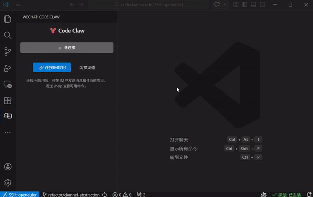

**[中文](#中文) | English**

<a id="english"></a>

# Code Claw: AI Coding Power in Your Pocket

> Control Claude Code in your VSCode workspace from WeChat or Telegram



## Overview

A VSCode extension that turns your WeChat or Telegram into a remote control terminal for Claude Code. Send a message from your phone, and Claude Code in VSCode writes code for you.

### Why Code Claw?

- 🏛️ **Uses official APIs** — WeChat ClawBot (iLink) API + Telegram Bot API
- 📱 **Dual-channel support** — WeChat (QR scan) and Telegram (Bot Token)
- 📦 **Bundled Claude Code CLI** — zero external dependencies, install and go
- 🔁 **Persistent sessions** — Claude remembers context across messages
- 🔌 **Any Anthropic-compatible API** — works with OpenRouter, AWS Bedrock, custom endpoints
- 🌐 **Bilingual UI** — automatically switches between Chinese and English based on system locale

## ✨ Features

| Feature | Description |
|---------|-------------|
| 📱 **QR Code Binding** | Display a QR code in the VSCode sidebar WebView; scan with WeChat to bind |
| ✈️ **Telegram Bot** | Enter a Bot Token (from @BotFather) to connect via Telegram |
| 🔄 **Background Polling** | Automatically long-polls for messages in the background |
| 💬 **IM → Claude** | Send text/images from WeChat/Telegram; Claude Code processes the request |
| 🔁 **Continuous Sessions** | Maintains context across conversations; `/new` to start fresh |
| 📋 **TodoList Tracking** | Task progress automatically pushed to IM with a progress bar |
| 🛡️ **Permission Detection** | Auto-detects tool permission denials and prompts `/mode` switch |
| 📊 **Status Bar** | Real-time connection state with dynamic channel name |
| 🗂️ **Sidebar Panel** | Code Claw icon in Activity Bar with QR code, status, and controls |
| 📝 **Slash Commands** | `/help`, `/new`, `/model`, `/mode`, `/status`, `/cwd` |
| 💾 **Session Persistence** | Auto-reconnects on VSCode restart; disconnect preserves account |
| 🔄 **Channel Switching** | Switch between WeChat and Telegram with one click |
| 🌐 **i18n** | Chinese/English UI based on system locale |

## 🚀 Quick Start

### Prerequisites

- **VSCode** >= 1.85.0
- **WeChat** with ClawBot support, **OR** **Telegram** account

### Installation

#### From VSIX (recommended)

1. Get the `codeclaw-vscode-0.1.79.vsix` file
2. In VSCode, press `Ctrl+Shift+P` (macOS: `Cmd+Shift+P`)
3. Type `Extensions: Install from VSIX...`
4. Select the `.vsix` file
5. Reload the VSCode window

#### From VSCode Marketplace (after publishing)

Search for **"Code Claw"** in the Extensions view and click Install.

### Getting Started

> 📖 For a detailed step-by-step guide, see [Quick Start Guide](docs/quick_start.md).

1. **Open a project** — Open a project folder in VSCode
2. **Choose a channel** — Click the Code Claw icon in the Activity Bar, click "Switch Channel" to choose WeChat or Telegram
3. **Connect** — Scan QR code (WeChat) or enter Bot Token (Telegram)
4. **Start chatting** — Send messages from your phone to control Claude Code

## ⚙️ Configuration

### Extension Settings

| Setting | Description | Default |
|---------|-------------|---------|
| `codeClaw.telegramApiBaseUrl` | Telegram Bot API base URL | `https://api.telegram.org` |
| `codeClaw.telegramPollTimeout` | Telegram long-poll timeout (seconds) | `30` |
| `codeClaw.streaming` | Enable streaming intermediate output | `true` |
| `codeClaw.environmentVariables` | API credentials (see below) | — |

### Environment Variables

```jsonc
{
  "codeClaw.environmentVariables": [
    { "name": "ANTHROPIC_BASE_URL", "value": "<Model API Endpoint>" },
    { "name": "ANTHROPIC_AUTH_TOKEN", "value": "<your-api-token-here>" },
    { "name": "ANTHROPIC_MODEL", "value": "<model-name>" }
  ]
}
```

## 💬 Commands (Slash Commands)

| Command | Description | Example |
|---------|-------------|---------|
| `/help` | Show help information | `/help` |
| `/new` | Start a new session | `/new` |
| `/model <name>` | Switch Claude model | `/model claude-sonnet-4-6` |
| `/mode <mode>` | Switch permission mode | `/mode 2` |
| `/status` | View current session status | `/status` |
| `/cwd <path>` | Change working directory | `/cwd /home/user/project` |

### Permission Modes

| Mode | Description | Shortcut |
|------|-------------|----------|
| `plan` | Plan only, no execution | `0` |
| `default` | Default — prompt for confirmation | `1` |
| `acceptEdits` | Auto-accept file edits | `2` |
| `bypassPermissions` | Skip all permission checks | `3+` |

## ⚠️ Notes

- WeChat depends on network connectivity to `ilinkai.weixin.qq.com`
- Telegram depends on network connectivity to `api.telegram.org`
- Sessions may expire — click "Switch Channel" to rebind
- Disconnect preserves account data for instant reconnect
- Switch projects freely — your account is not locked to one directory

## 📄 License

MIT

## 🙏 Acknowledgements

- WeChat ClawBot integration inspired by [wechat-claude-code](https://github.com/Wechat-ggGitHub/wechat-claude-code) (MIT License)

---

<a id="中文"></a>

# Code Claw：口袋里的 AI 编程助手

> 通过微信或 Telegram 远程控制 VSCode 项目中的 Claude Code

**English | [中文](#english)**


## 概述

一个 VSCode 扩展，通过微信或 Telegram 将你的手机变成 Claude Code 的远程控制终端。手机发消息，VSCode 里的 Claude Code 帮你写代码。

### 核心卖点

- 🏛️ **使用官方 API** — 微信 ClawBot (iLink) API + Telegram Bot API
- 📱 **双渠道支持** — 微信（扫码绑定）和 Telegram（Bot Token）
- 📦 **内置 Claude Code CLI** — 零外部依赖，安装即用
- 🔁 **持续会话** — Claude 在消息间保持上下文记忆
- 🔌 **兼容多种 API** — 支持 OpenRouter、AWS Bedrock、自定义端点
- 🌐 **中英双语** — 根据系统语言自动切换界面语言

## ✨ 功能特性

| 功能 | 说明 |
|------|------|
| 📱 **扫码绑定** | VSCode 侧边栏显示二维码，微信扫描即可绑定 |
| ✈️ **Telegram Bot** | 输入 Bot Token（从 @BotFather 获取）连接 Telegram |
| 🔄 **后台监听** | 绑定后自动在后台长轮询监听消息 |
| 💬 **IM 操控项目** | 微信/Telegram 发送文字/图片，Claude Code 处理请求 |
| 🔁 **持续会话** | 连续对话保持上下文，`/new` 开启新会话 |
| 📋 **TodoList 追踪** | 自动推送任务进度到 IM |
| 🛡️ **权限拒绝检测** | 自动检测并提示切换 `/mode` |
| 📊 **状态栏** | 实时显示连接状态和渠道名 |
| 🗂️ **侧边栏面板** | Activity Bar 图标，显示二维码、状态和控制 |
| 📝 **斜杠命令** | `/help`、`/new`、`/model`、`/mode`、`/status`、`/cwd` |
| 💾 **会话持久化** | 重启自动重连，断开保留账号 |
| 🔄 **渠道切换** | 一键切换微信和 Telegram |
| 🌐 **国际化** | 根据系统语言自动切换中英文界面 |

## 🚀 快速开始

### 前置条件

- **VSCode** >= 1.85.0
- **微信**（支持 ClawBot）或 **Telegram** 账号

### 安装

#### 从 VSIX 安装（推荐）

1. 获取 `codeclaw-vscode-0.1.79.vsix` 文件
2. VSCode 中按 `Ctrl+Shift+P`
3. 输入 `Extensions: Install from VSIX...`
4. 选择 `.vsix` 文件
5. 重新加载窗口

### 使用步骤

> 📖 详细分步指南请查看 [快速开始指南](docs/quick_start_cn.md)。

1. **打开项目** — VSCode 中打开项目文件夹
2. **选择渠道** — 点击左侧 Activity Bar 的 Code Claw 图标，点击"切换渠道"选择微信或 Telegram
3. **连接** — 扫描二维码（微信）或输入 Bot Token（Telegram）
4. **开始使用** — 在手机中发送消息即可操作项目

## ⚙️ 配置说明

### 扩展设置

| 设置项 | 说明 | 默认值 |
|--------|------|--------|
| `codeClaw.telegramApiBaseUrl` | Telegram Bot API 地址 | `https://api.telegram.org` |
| `codeClaw.telegramPollTimeout` | Telegram 长轮询超时（秒） | `30` |
| `codeClaw.streaming` | 启用流式中间输出 | `true` |
| `codeClaw.environmentVariables` | API 凭证配置 | — |

### 环境变量

```jsonc
{
  "codeClaw.environmentVariables": [
    { "name": "ANTHROPIC_BASE_URL", "value": "<模型 API 地址>" },
    { "name": "ANTHROPIC_AUTH_TOKEN", "value": "<你的 API Token>" },
    { "name": "ANTHROPIC_MODEL", "value": "<模型名称>" }
  ]
}
```

## 💬 命令

| 命令 | 说明 | 示例 |
|------|------|------|
| `/help` | 显示帮助 | `/help` |
| `/new` | 开启新会话 | `/new` |
| `/model <名称>` | 切换模型 | `/model claude-sonnet-4-6` |
| `/mode <模式>` | 切换权限模式 | `/mode 2` |
| `/status` | 查看状态 | `/status` |
| `/cwd <路径>` | 切换工作目录 | `/cwd /home/user/project` |

### 权限模式

| 模式 | 说明 | 快捷键 |
|------|------|--------|
| `plan` | 仅规划不执行 | `0` |
| `default` | 默认逐次确认 | `1` |
| `acceptEdits` | 自动接受编辑 | `2` |
| `bypassPermissions` | 跳过所有权限检查 | `3+` |

## ⚠️ 注意事项

- 微信依赖 `ilinkai.weixin.qq.com` 网络连通性
- Telegram 依赖 `api.telegram.org` 网络连通性
- 会话可能过期，点击"切换渠道"重新绑定
- 断开连接保留账号数据，可立即重连
- 账号不锁定到某个项目，可自由切换

## 📄 License

MIT

## 🙏 致谢

- 微信 ClawBot 集成参考了 [wechat-claude-code](https://github.com/Wechat-ggGitHub/wechat-claude-code)（MIT 协议）
